Fluxigut Analysis
================
2026-05-08

- [Libraries](#libraries)
- [Constants](#constants)
- [1. Data Import](#1-data-import)
- [2. Phyloseq Construction &
  Filtering](#2-phyloseq-construction--filtering)
- [3. Genus-Level Aggregation &
  Transformation](#3-genus-level-aggregation--transformation)
- [4. Differential Abundance —
  ANCOM-BC2](#4-differential-abundance--ancom-bc2)
  - [Fix taxon labels](#fix-taxon-labels)
  - [Pivot to long format](#pivot-to-long-format)
  - [Heatmap](#heatmap)
- [5. Alpha Diversity](#5-alpha-diversity)
- [6. Beta Diversity](#6-beta-diversity)
- [7. Targeted Metabolomics](#7-targeted-metabolomics)
  - [Import](#import)
  - [Delta concentration (t48 − t0)](#delta-concentration-t48--t0)
  - [Normalization references](#normalization-references)
  - [Supplementary Figure S1 — Raw concentrations
    QC](#supplementary-figure-s1--raw-concentrations-qc)
  - [Supplementary Figure S2 — %
    remaining](#supplementary-figure-s2---remaining)
- [8. Abundance–Concentration
  Correlations](#8-abundanceconcentration-correlations)
  - [Panel A — Heatmap](#panel-a--heatmap)
  - [Panel B — Scatter plots](#panel-b--scatter-plots)
- [9. Supplementary — Ciprofloxacin
  Correlations](#9-supplementary--ciprofloxacin-correlations)
  - [Panel A — Cipro heatmap](#panel-a--cipro-heatmap)
  - [Panel B — Cipro scatter plots](#panel-b--cipro-scatter-plots)
- [10. OD600 Analysis](#10-od600-analysis)

## Libraries

``` r
library(phyloseq)
library(microbiome)
library(ANCOMBC)
library(pheatmap)
library(WGCNA)        
library(vegan)
library(tidyverse)
library(rstatix)
library(ggpubr)
library(lme4)
library(lmerTest)
library(emmeans)
library(pairwiseAdonis)
library(scales)
library(patchwork)
library(grid)         
```

## Constants

``` r
treatment_levels <- c("Vehicle", "Flutamide", "Fluazinam", "Pretomanid",
                      "Capecitabine", "Posaconazole", "Elagolix", "Fulvestrant", "Lasmiditan",
                      "Letermovir", "Ciprofloxacin", "Ezetimibe", "Fluometuron", "Tembotrione",
                      "Fluopicolide", "Aprepitant")
```

------------------------------------------------------------------------

## 1. Data Import

``` r
# Metadata
Fluxigut_metadata <- read_csv("data/metadata/Fluxigut_metadata_clean.csv")

# Feature table
features <- read_tsv("data/sequencing/feature-table.tsv.gz", skip = 1) %>%
  column_to_rownames("#OTU ID") %>%
  select(any_of(Fluxigut_metadata$sample_id))

# Taxonomy (SILVA 138 weighted)
taxonomy_Silva <- read_tsv("data/sequencing/taxonomy_SILVA_weighted.tsv")

taxonomy  <- taxonomy_Silva
tax_split <- str_split_fixed(taxonomy$Taxon, ";", 7)
colnames(tax_split) <- c("Kingdom", "Phylum", "Class", "Order", "Family", "Genus", "Species")
taxonomy_table <- tax_table(as.matrix(tax_split))
rownames(taxonomy_table) <- taxonomy$`Feature ID`
```

------------------------------------------------------------------------

## 2. Phyloseq Construction & Filtering

``` r
# Metadata for phyloseq
metadata_ps <- Fluxigut_metadata %>%
  mutate(Patient   = factor(Patient),
         Treatment = factor(Treatment, levels = treatment_levels)) %>%
  column_to_rownames("sample_id")

# Create phyloseq object
ps <- phyloseq(otu_table(features, taxa_are_rows = TRUE), taxonomy_table, sample_data(metadata_ps))

# Subset
ps_filtered <- prune_taxa(taxa_sums(ps) > 0, ps)
ps_filtered <- subset_taxa(ps_filtered, is.na(Genus) | !grepl("Chloroplast", Genus, ignore.case = TRUE))
ps_filtered <- subset_taxa(ps_filtered, is.na(Genus) | !grepl("Mitochondria", Genus, ignore.case = TRUE))
ps_filtered <- subset_taxa(ps_filtered, !grepl("Archaea", Kingdom, ignore.case = TRUE))
ps_filtered <- prune_taxa(taxa_sums(ps_filtered) > 0, ps_filtered) %>%
  prune_samples(sample_sums(.) > 1000, .)
```

## 3. Genus-Level Aggregation & Transformation

Glom to genus first, then prevalence filter. CLR transformation for
correlations.

``` r
# Main analysis object
ps_analysis <- ps_filtered

# Collapse to genus level first, then prevalence filter
ps_genus <- tax_glom(ps_analysis, taxrank = "Genus")
ps_genus <- filter_taxa(ps_genus, function(x) sum(x > 0) >= 3 & sum(x) > 10, TRUE)

# Relative abundance 
ps_rel_genus <- transform_sample_counts(ps_genus, function(x) x / sum(x))

# CLR transformation (for correlations)
ps_clr_genus <- microbiome::transform(ps_genus, "clr")
stopifnot(!any(!is.finite(as(otu_table(ps_clr_genus), "matrix"))))
```

------------------------------------------------------------------------

## 4. Differential Abundance — ANCOM-BC2

``` r
set.seed(1234) 

out <- ancombc2(ps_analysis,
                tax_level    = "Genus",
                fix_formula  = "Treatment",
                rand_formula = "(1|Patient)",
                p_adj_method = "holm",
                lib_cut      = 1000,
                group        = "Treatment",
                struc_zero   = TRUE,
                neg_lb       = FALSE,
                dunnet       = TRUE,
                global       = TRUE,
                pairwise     = FALSE,
                n_cl         = 10)

# Save object to avoid re-running
# out_saved <- out
# out <- out_saved

res_df <- out$res_dunn
```

### Fix taxon labels

``` r
# Lookup table: Genus -> Family (for context labels)
tax_ref <- as.data.frame(tax_table(ps_analysis)) %>%
  select(Family, Genus) %>%
  distinct() %>%
  mutate(
    Ref_Family_Clean = Family %>% str_remove("^f__") %>% str_remove_all("[^a-zA-Z0-9\\-]"),
    Join_Key         = Genus  %>% str_remove("^g__") %>% str_remove_all("[^a-zA-Z0-9]")
  ) %>%
  filter(Join_Key != "")

res_df <- res_df %>%
  mutate(
    Is_Long_Lineage = str_detect(taxon, "d__") & !str_detect(taxon, "g__"),
    Raw_Extract = case_when(
      Is_Long_Lineage ~ str_extract(taxon, "(?<=f__)[A-Za-z0-9\\-]+"),
      TRUE            ~ str_extract(taxon, "(?<=g__)[A-Za-z0-9\\-\\[\\]_\\s]+")
    ),
    Join_Key           = Raw_Extract %>% str_remove_all("[^a-zA-Z0-9]"),
    Display_Name_Clean = Raw_Extract %>% str_remove_all("\\[|\\]") %>%
      str_replace_all("_", " ") %>% str_trim()
  ) %>%
  left_join(tax_ref, by = "Join_Key") %>%
  mutate(
    Ref_Family_Clean = case_when(
      !is.na(Ref_Family_Clean) ~ Ref_Family_Clean,
      Is_Long_Lineage          ~ Display_Name_Clean,
      TRUE                     ~ "Unknown"
    ),
    Final_Label = case_when(
      Is_Long_Lineage ~
        paste0("f__", Ref_Family_Clean),
      str_detect(Display_Name_Clean, "ceae") |
        (!is.na(Ref_Family_Clean) & str_detect(Display_Name_Clean, fixed(Ref_Family_Clean, ignore_case = TRUE))) ~
        paste0("g__", Display_Name_Clean),
      str_detect(Display_Name_Clean, "CAG|UCG|Incertae|uncultured|dgA|R-7") ~
        paste0("f__", Ref_Family_Clean, " (g__", Display_Name_Clean, ")"),
      TRUE ~
        paste0("g__", Display_Name_Clean)
    ),
    taxon = make.unique(Final_Label, sep = "_")
  ) %>%
  select(-Is_Long_Lineage, -Raw_Extract, -Join_Key, -Display_Name_Clean,
         -Ref_Family_Clean, -Final_Label)
```

### Pivot to long format

``` r
lfc_cols  <- grep("^lfc_",  names(res_df), value = TRUE)
se_cols   <- grep("^se_",   names(res_df), value = TRUE)
p_cols    <- grep("^p_",    names(res_df), value = TRUE)
q_cols    <- grep("^q_",    names(res_df), value = TRUE)
diff_cols <- grep("^diff_", names(res_df), value = TRUE)

lfc_long <- res_df %>%
  select(taxon, all_of(lfc_cols)) %>%
  pivot_longer(-taxon, names_to = "Treatment", values_to = "LFC") %>%
  mutate(Treatment = str_remove(Treatment, "^lfc_Treatment"))

se_long <- res_df %>%
  select(taxon, all_of(se_cols)) %>%
  pivot_longer(-taxon, names_to = "Treatment", values_to = "se") %>%
  mutate(Treatment = str_remove(Treatment, "^se_Treatment"))

p_long <- res_df %>%
  select(taxon, all_of(p_cols)) %>%
  pivot_longer(-taxon, names_to = "Treatment", values_to = "pval") %>%
  mutate(Treatment = str_remove(Treatment, "^p_Treatment"))

q_long <- res_df %>%
  select(taxon, all_of(q_cols)) %>%
  pivot_longer(-taxon, names_to = "Treatment", values_to = "qval") %>%
  mutate(Treatment = str_remove(Treatment, "^q_Treatment"))

diff_long <- res_df %>%
  select(taxon, all_of(diff_cols)) %>%
  pivot_longer(-taxon, names_to = "Treatment", values_to = "Significant") %>%
  mutate(Treatment = str_remove(Treatment, "^diff_Treatment"))

results_long <- lfc_long %>%
  left_join(p_long,    by = c("taxon", "Treatment")) %>%
  left_join(se_long,   by = c("taxon", "Treatment")) %>%
  left_join(q_long,    by = c("taxon", "Treatment")) %>%
  left_join(diff_long, by = c("taxon", "Treatment")) %>%
  filter(Treatment != "(Intercept)")
```

### Heatmap

``` r
results_max_min <- results_long %>%
  summarise(val = round(max(abs(LFC), na.rm = TRUE), 1))

# Stars matrix (Holm-adjusted q-values)
stars_matrix <- results_long %>%
  select(taxon, Treatment, qval) %>%
  mutate(across(where(is.numeric),
                ~ case_when(
                  . <= 0.0001 ~ "****",
                  . <= 0.001  ~ "***",
                  . <= 0.01   ~ "**",
                  . <= 0.05   ~ "*",
                  . <= 0.1    ~ "·",
                  .default    = ""
                ))) %>%
  pivot_wider(names_from = Treatment, values_from = qval) %>%
  column_to_rownames("taxon")

significant_taxa_list <- results_long %>%
  filter(pval < 0.05) %>%
  pull(taxon) %>%
  unique()

sig_results <- results_long %>%
  filter(taxon %in% significant_taxa_list)

lfc_mat <- sig_results %>%
  select(taxon, Treatment, LFC) %>%
  pivot_wider(names_from = Treatment, values_from = LFC) %>%
  column_to_rownames("taxon") %>%
  as.matrix()

lfc_mat[is.na(lfc_mat)] <- 0

stars_matrix_clean <- stars_matrix[rownames(lfc_mat), ]
breaksList          <- seq(-results_max_min$val, results_max_min$val, by = 0.1)
italic_labels       <- as.expression(lapply(rownames(lfc_mat), function(x) bquote(italic(.(x)))))

# Plot
ph_ancom <- pheatmap(lfc_mat,
                     breaks                    = breaksList,
                     clustering_distance_rows  = "correlation",
                     clustering_method         = "ward.D2",
                     cluster_rows              = TRUE,
                     cluster_cols              = FALSE,
                     display_numbers           = stars_matrix_clean,
                     labels_row                = italic_labels,
                     fontsize                  = 15,
                     fontsize_number           = 15,
                     cellwidth                 = 40,
                     color                     = blueWhiteRed(length(breaksList), gamma = 1))
```

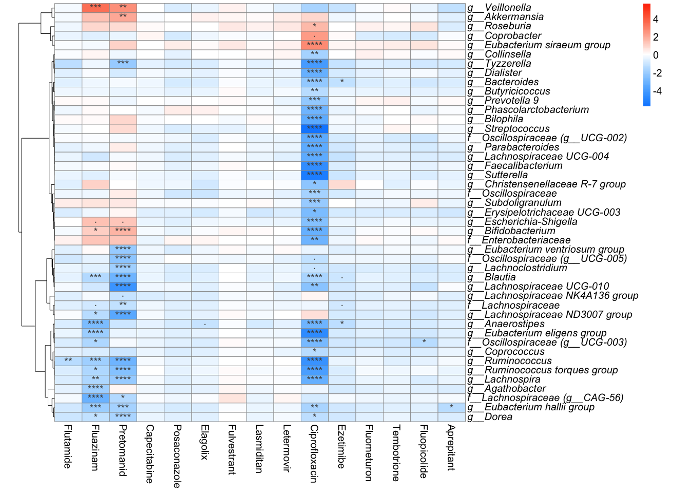<!-- -->

``` r
png("results/ANCOM.png", width = 14, height = 10, units = "in", res = 320)
grid.newpage()
grid.draw(ph_ancom$gtable)
dev.off()
```

    ## quartz_off_screen 
    ##                 2

------------------------------------------------------------------------

## 5. Alpha Diversity

Rarefied to 1,000 reads. Shannon entropy compared to Vehicle using an
LMM (random intercept per donor) with Dunnett contrasts.

``` r
ps_rare <- ps_filtered %>%
  rarefy_even_depth(sample.size = 1000, rngseed = 1, verbose = TRUE)
```

``` r
alpha_tab <- estimate_richness(ps_rare, measures = c("Observed", "Shannon"))

meta_df <- as(sample_data(ps_rare), "data.frame") %>%
  rownames_to_column("ID") %>%
  mutate(ID = make.names(ID))

alpha_df <- alpha_tab %>%
  rownames_to_column("ID") %>%
  left_join(meta_df, by = "ID") %>%
  filter(!str_detect(Sample_ID, "(?i)fecal")) %>%
  mutate(
    Patient   = factor(Patient),
    Treatment = factor(Treatment, levels = treatment_levels) %>% relevel(ref = "Vehicle"))

# Patient anonymization map (used throughout downstream figures)
id_map <- alpha_df %>%
  distinct(Patient) %>%
  arrange(Patient) %>%
  mutate(Patient_new = row_number())

# LMM: Shannon ~ Treatment + (1 | Patient)
m1 <- lmer(Shannon ~ Treatment + (1 | Patient), data = alpha_df)

# Dunnett contrasts vs Vehicle
emm_alpha     <- emmeans(m1, "Treatment")
alpha_results <- contrast(emm_alpha, method = "trt.vs.ctrl", ref = "Vehicle", adjust = "dunnett") %>%
  summary(infer = TRUE) %>%
  as.data.frame()

contr <- alpha_results %>%
  mutate(
    Treatment = sub(" - Vehicle", "", contrast),
    label = case_when(
      p.value <= 0.0001 ~ "****",
      p.value <= 0.001  ~ "***",
      p.value <= 0.01   ~ "**",
      p.value <= 0.05   ~ "*",
      p.value <= 0.1    ~ "·",
      .default          = ""))

# Within-patient deltas (Treatment - Vehicle)
trt_no_vehicle <- setdiff(treatment_levels, "Vehicle")

delta_df <- alpha_df %>%
  select(Patient, Treatment, Shannon) %>%
  mutate(Treatment = factor(Treatment, levels = treatment_levels)) %>%
  pivot_wider(names_from = Treatment, values_from = Shannon) %>%
  filter(!is.na(Vehicle)) %>%
  pivot_longer(cols = all_of(trt_no_vehicle), names_to = "Treatment", values_to = "Shannon_trt") %>%
  mutate(
    delta     = Shannon_trt - Vehicle,
    Treatment = factor(Treatment, levels = trt_no_vehicle)) %>%
  filter(!is.na(delta))

delta_range <- max(delta_df$delta, na.rm = TRUE) - min(delta_df$delta, na.rm = TRUE)
if (!is.finite(delta_range) || delta_range == 0) delta_range <- 1

delta_sum <- delta_df %>%
  group_by(Treatment) %>%
  summarise(y = max(delta, na.rm = TRUE), .groups = "drop") %>%
  mutate(y = pmax(y, 0) + 0.08 * delta_range) %>%
  left_join(contr %>% select(Treatment, label), by = "Treatment")

p_alpha <- delta_df %>%
  left_join(id_map, by = "Patient") %>%
  mutate(Patient = factor(Patient_new, levels = 1:13)) %>%
  ggplot(aes(x = Treatment, y = delta)) +
  geom_hline(yintercept = 0, linetype = "dashed", linewidth = 1) +
  geom_boxplot(outlier.shape = NA, color = "grey25", fill = "grey90", linewidth = 0.35) +
  geom_jitter(width = 0, alpha = 1, size = 3, aes(fill = Patient),
              stroke = 0.5, colour = "black", shape = 21) +
  geom_text(data = delta_sum, aes(y = y, label = label), vjust = 0, size = 9) +
  scale_fill_viridis_d(option = "mako", name = "Donor") +
  theme_bw(base_size = 22) +
  theme(axis.text.x = element_text(angle = 45, hjust = 1)) +
  scale_y_continuous(expand = expansion(mult = c(0.05, 0.1))) +
  labs(x = NULL, y = expression(paste(Delta, " Shannon Entropy (Treatment - Vehicle)")))

p_alpha
```

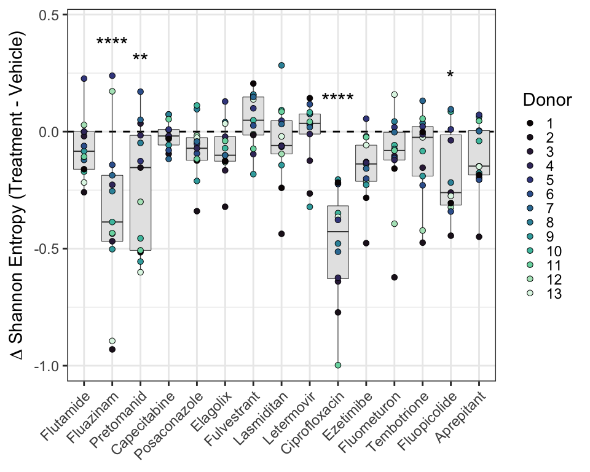<!-- -->

``` r
ggsave("results/Alpha_diversity.png", p_alpha, dpi = 320, units = "in", width = 10, height = 8)
```

------------------------------------------------------------------------

## 6. Beta Diversity

Bray-Curtis dissimilarity to each donor’s own Vehicle sample. Global
PERMANOVA stratified by donor, followed by Dunnett-style pairwise
PERMANOVA

``` r
ps_rare_filtered <- subset_samples(ps_rare, !str_detect(Sample_ID, "(?i)fecal"))

dist_obj <- phyloseq::distance(ps_rare_filtered, method = "bray")
D        <- as.matrix(dist_obj)

md <- sample_data(ps_rare_filtered) %>%
  data.frame() %>%
  rownames_to_column("SampleID") %>%
  mutate(
    Patient   = factor(Patient),
    Treatment = factor(Treatment, levels = treatment_levels) %>% relevel(ref = "Vehicle")
  )

veh_lookup <- md %>%
  filter(Treatment == "Vehicle") %>%
  group_by(Patient) %>%
  summarise(veh_ids = list(SampleID), .groups = "drop")

beta_df <- md %>%
  filter(Treatment != "Vehicle") %>%
  left_join(veh_lookup, by = "Patient") %>%
  rowwise() %>%
  mutate(dist_to_vehicle = mean(D[SampleID, unlist(veh_ids)], na.rm = TRUE)) %>%
  ungroup() %>%
  select(Patient, Treatment, dist_to_vehicle)

beta_df_clean <- beta_df %>%
  group_by(Patient, Treatment) %>%
  summarise(dist_to_vehicle = mean(dist_to_vehicle, na.rm = TRUE), .groups = "drop")

plot_data_final <- beta_df_clean %>%
  filter(Treatment != "Vehicle") %>%
  mutate(Treatment = factor(Treatment, levels = treatment_levels))

# Global PERMANOVA (stratified by Patient)
ps_rare_filtered_clean <- subset_samples(ps_rare_filtered, !is.na(Treatment) & !is.na(Patient))
dist_clean             <- phyloseq::distance(ps_rare_filtered_clean, method = "bray")
md_clean               <- data.frame(sample_data(ps_rare_filtered_clean))

perm_result <- adonis2(dist_clean ~ Treatment,
                       data         = md_clean,
                       permutations = 999,
                       strata       = md_clean$Patient)
print(perm_result)
```

    ## Permutation test for adonis under reduced model
    ## Blocks:  strata 
    ## Permutation: free
    ## Number of permutations: 999
    ## 
    ## adonis2(formula = dist_clean ~ Treatment, data = md_clean, permutations = 999, strata = md_clean$Patient)
    ##           Df SumOfSqs      R2      F Pr(>F)    
    ## Model     15    3.484 0.05655 0.7552  0.001 ***
    ## Residual 189   58.130 0.94345                  
    ## Total    204   61.615 1.00000                  
    ## ---
    ## Signif. codes:  0 '***' 0.001 '**' 0.01 '*' 0.05 '.' 0.1 ' ' 1

``` r
# Dunnett-style pairwise PERMANOVA
pair_res_raw <- pairwise.adonis(dist_clean,
                                md_clean$Treatment,
                                p.adjust.m = "none",
                                perm       = 999)

vs_vehicle_only <- pair_res_raw %>%
  filter(grepl("Vehicle", pairs)) %>%
  mutate(p.adj = p.adjust(p.value, method = "fdr"))

print(vs_vehicle_only %>% filter(p.adj < 0.05))
```

    ##                      pairs Df SumsOfSqs  F.Model        R2 p.value p.adjusted sig p.adj
    ## 1 Vehicle vs Ciprofloxacin  1  0.973783 3.153089 0.1205628   0.001      0.001  ** 0.015

``` r
stats_annot <- vs_vehicle_only %>%
  filter(p.adj < 0.05) %>%
  mutate(
    Treatment = gsub("Vehicle vs |vs Vehicle", "", pairs) %>% str_trim(),
    label = case_when(
      p.adj <= 0.001 ~ "***",
      p.adj <= 0.01  ~ "**",
      p.adj <= 0.05  ~ "*",
      .default       = ""
    )
  ) %>%
  left_join(
    plot_data_final %>%
      group_by(Treatment) %>%
      summarise(max_val = max(dist_to_vehicle, na.rm = TRUE)),
    by = "Treatment"
  ) %>%
  mutate(y_pos = max_val + 0.03)

p_beta <- plot_data_final %>%
  left_join(id_map, by = "Patient") %>%
  mutate(Patient = factor(Patient_new, levels = 1:13)) %>%
  ggplot(aes(x = Treatment, y = dist_to_vehicle)) +
  geom_hline(yintercept = 0, linetype = "dashed", linewidth = 1) +
  geom_boxplot(outlier.shape = NA, color = "grey25", fill = "grey90", linewidth = 0.35) +
  geom_jitter(width = 0, alpha = 1, size = 3, aes(fill = Patient),
              stroke = 0.5, colour = "black", shape = 21) +
  geom_text(data = stats_annot, aes(x = Treatment, y = y_pos, label = label),
            inherit.aes = FALSE, size = 9, vjust = 0) +
  scale_fill_viridis_d(option = "mako", name = "Donor") +
  theme_bw(base_size = 22) +
  theme(axis.text.x = element_text(angle = 45, hjust = 1)) +
  labs(x = NULL, y = "Bray-Curtis Dissimilarity to Vehicle",
       colour = "Donor", fill = "Donor") +
  scale_y_continuous(expand = expansion(mult = c(0.1, 0.1)))

p_beta
```

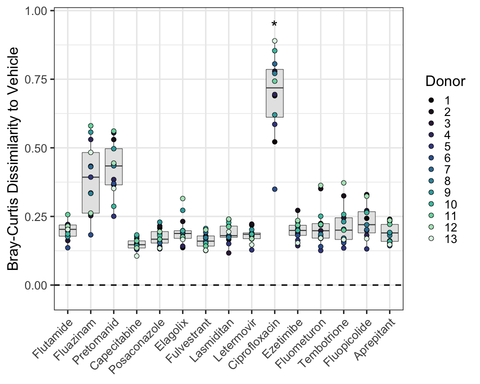<!-- -->

``` r
ggsave("results/Beta_diversity.png", p_beta, dpi = 320, units = "in", width = 10, height = 8)
```

------------------------------------------------------------------------

## 7. Targeted Metabolomics

### Import

``` r
Data_clean_vehicle <- read_csv("data/concentrations/RP_DataClean.csv") %>%
  mutate(Timepoint = as.factor(Timepoint))

Data_clean <- Data_clean_vehicle %>%
  filter(Patient != "PBS")

calculated_concentrations <- Data_clean_vehicle %>%
  mutate(Timepoint = paste0("t", Timepoint))
```

### Delta concentration (t48 − t0)

One-sample Wilcoxon vs 0, Holm-adjusted.

``` r
plot_df <- Data_clean %>%
  select(-Replicate) %>%
  mutate(Timepoint = paste0("t", Timepoint)) %>%
  pivot_wider(names_from = Timepoint, values_from = Calculated.Concentration) %>%
  mutate(delta = t48 - t0) %>%
  drop_na(delta) %>%
  mutate(Treatment = factor(Treatment, levels = treatment_levels))

stat_test <- plot_df %>%
  group_by(Treatment) %>%
  summarise(
    p.value = if (length(delta) >= 3) wilcox.test(delta, mu = 0)$p.value else NA,
    .groups = "drop"
  ) %>%
  mutate(
    p.adj = p.adjust(p.value, method = "holm"),
    label = case_when(
      p.adj < 0.001 ~ "***",
      p.adj < 0.01  ~ "**",
      p.adj < 0.05  ~ "*",
      p.adj < 0.1   ~ "·",
      TRUE          ~ ""
    )
  )

stats_annot <- plot_df %>%
  group_by(Treatment) %>%
  summarise(y_pos = max(delta, na.rm = TRUE), .groups = "drop") %>%
  left_join(stat_test, by = "Treatment") %>%
  filter(label != "") %>%
  mutate(y_pos = y_pos + (max(plot_df$delta, na.rm = TRUE) - min(plot_df$delta, na.rm = TRUE)) * 0.1)

p_delta <- plot_df %>%
  left_join(id_map, by = "Patient") %>%
  mutate(Patient = factor(Patient_new, levels = 1:13)) %>%
  ggplot(aes(x = Treatment, y = delta)) +
  geom_hline(yintercept = 0, linetype = "dashed", linewidth = 1, color = "black") +
  geom_boxplot(outlier.shape = NA, color = "grey25", fill = "grey90", linewidth = 0.35) +
  geom_jitter(width = 0, alpha = 1, size = 2.5, aes(fill = Patient),
              stroke = 0.5, colour = "black", shape = 21) +
  geom_text(data = stats_annot, aes(x = Treatment, y = y_pos, label = label),
            inherit.aes = FALSE, size = 8, vjust = 0) +
  scale_fill_viridis_d(option = "mako", name = "Donor") +
  theme_bw(base_size = 20) +
  theme(
    axis.text.x      = element_text(angle = 45, hjust = 1, color = "black"),
    panel.grid.minor = element_blank()
  ) +
  scale_y_continuous(expand = expansion(mult = c(0.1, 0.15))) +
  labs(x = NULL, y = expression(paste(Delta, " Concentration (t48 - t0) µM")))

p_delta
```

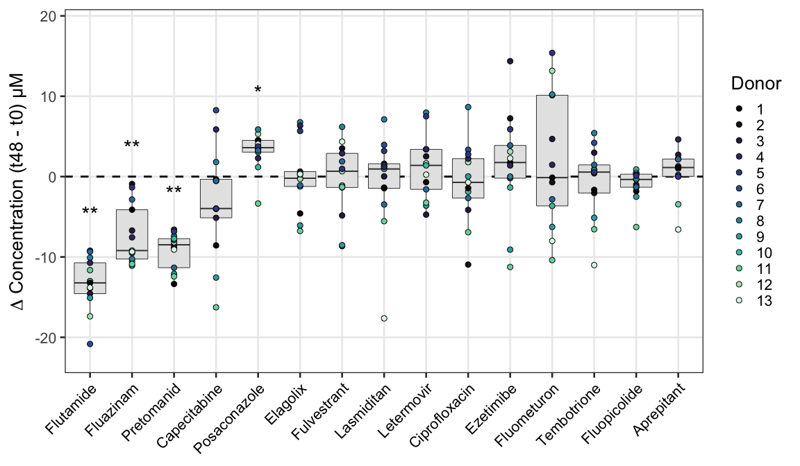<!-- -->

``` r
ggsave("results/Concentrations_delta.png", p_delta, dpi = 320, units = "in", width = 12, height = 7)
```

### Normalization references

``` r
references <- calculated_concentrations %>%
  group_by(Treatment) %>%
  summarise(
    Median_T0          = median(Calculated.Concentration[Timepoint == "t0"  & Patient == "PBS"], na.rm = TRUE),
    Median_Vehicle_T48 = median(Calculated.Concentration[Timepoint == "t48" & Patient == "PBS"], na.rm = TRUE),
    Donor_Q3_T48       = quantile(Calculated.Concentration[Timepoint == "t48" & Patient != "PBS"], 0.75, na.rm = TRUE)
  ) %>%
  mutate(
    Is_Unstable_Crash      = Median_Vehicle_T48 < (Median_T0 * 0.1),
    Is_Vehicle_Drop_Rescue = (Median_Vehicle_T48 < (Median_T0 * 0.7)) & (Donor_Q3_T48 > (Median_T0 * 0.6)),
    Final_Reference = case_when(
      Is_Unstable_Crash | Is_Vehicle_Drop_Rescue ~ Median_T0,
      TRUE                                       ~ Median_Vehicle_T48
    ),
    Method_Used = case_when(
      Is_Unstable_Crash      ~ "T0_Norm (Chemically Unstable)",
      Is_Vehicle_Drop_Rescue ~ "T0_Norm (Vehicle Adsorption)",
      TRUE                   ~ "T48_Norm (Standard Normalization)"
    )
  )
```

### Supplementary Figure S1 — Raw concentrations QC

``` r
color_t0      <- "#4DBBD5"
color_vehicle <- "#E64B35"
color_donor   <- "grey60"

legend_order_s1 <- c("Abiotic Control (T0)", "Abiotic Control (T48)", "Donor Sample (T48)")

all_data_plot <- calculated_concentrations %>%
  mutate(Log_Conc = log10(Calculated.Concentration),
         Treatment = factor(Treatment, levels = treatment_levels))  

references_plot <- references %>%
  mutate(
    Log_Median_T0          = log10(Median_T0),
    Log_Median_Vehicle_T48 = log10(Median_Vehicle_T48),
    Treatment = factor(Treatment, levels = treatment_levels))      

Supp_Fig_1_Final <- ggplot(all_data_plot, aes(x = Treatment, y = Log_Conc)) +

  geom_errorbar(data = references_plot,
                aes(x = Treatment, ymin = Log_Median_T0, ymax = Log_Median_T0,
                    color = "Abiotic Control (T0)"),
                width = 0.9, linewidth = 1.5, inherit.aes = FALSE) +

  geom_errorbar(data = references_plot,
                aes(x = Treatment, ymin = Log_Median_Vehicle_T48, ymax = Log_Median_Vehicle_T48,
                    color = "Abiotic Control (T48)"),
                width = 0.9, linewidth = 1.5, inherit.aes = FALSE) +

  geom_jitter(data = filter(all_data_plot, Timepoint == "t48", Patient != "PBS"),
              aes(color = "Donor Sample (T48)", fill = "Donor Sample (T48)"),
              shape = 21, size = 2.5, stroke = 0.3, width = 0.2, alpha = 0.7) +

  geom_jitter(data = filter(all_data_plot, Timepoint == "t0", Patient == "PBS"),
              aes(color = "Abiotic Control (T0)", fill = "Abiotic Control (T0)"),
              shape = 4, size = 3, stroke = 1, width = 0, alpha = 1) +

  geom_jitter(data = filter(all_data_plot, Timepoint == "t48", Patient == "PBS"),
              aes(color = "Abiotic Control (T48)", fill = "Abiotic Control (T48)"),
              shape = 4, size = 3, stroke = 1, width = 0, alpha = 1) +

  scale_y_continuous(
    expand = expansion(mult = c(0.05, 0.15)),
    breaks = breaks_pretty(n = 6),
    labels = function(x) {
      val <- 10^x
      ifelse(val >= 1, comma(val, accuracy = 1), comma(val, accuracy = 0.01))
    }
  ) +
  scale_color_manual(name = "Sample Type", breaks = legend_order_s1,
                     values = c("Abiotic Control (T0)"  = color_t0,
                                "Abiotic Control (T48)" = color_vehicle,
                                "Donor Sample (T48)"    = "black")) +
  scale_fill_manual(name = "Sample Type", breaks = legend_order_s1,
                    values = c("Abiotic Control (T0)"  = color_t0,
                               "Abiotic Control (T48)" = color_vehicle,
                               "Donor Sample (T48)"    = color_donor)) +
  guides(color = guide_legend(override.aes = list(
    shape    = c(4, 4, 21),
    linetype = c(1, 1, 0),
    stroke   = c(2, 2, 0.3),
    fill     = c(NA, NA, color_donor),
    color    = c(color_t0, color_vehicle, "black")
  )), fill = "none") +
  theme_bw(base_size = 18) +
  theme(
    axis.text.x      = element_text(angle = 45, hjust = 1, color = "black"),
    axis.text.y      = element_text(color = "black"),
    legend.position  = "right",
    panel.grid.minor = element_blank()
  ) +
  labs(y = "Concentration (µM)", x = "Treatment")

Supp_Fig_1_Final
```

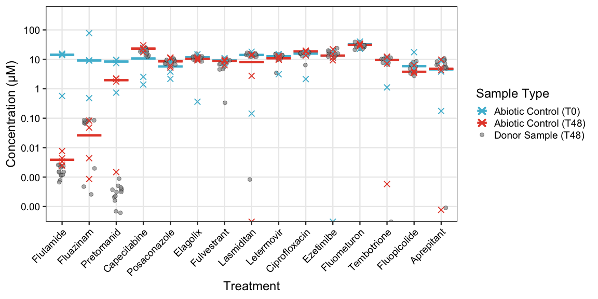<!-- -->

``` r
ggsave("results/Concentrations_vehicle_S1.png", Supp_Fig_1_Final,
       dpi = 320, units = "in", width = 12, height = 6)
```

### Supplementary Figure S2 — % remaining

``` r
lab_alt      <- "Alternative Normalization (Ref: T0)"
lab_std      <- "Standard Normalization (Ref: T48)"
lab_artifact <- "Unstable Normalization (Ref: T48)"
legend_order_s2 <- c(lab_alt, lab_std, lab_artifact)

df_dots <- calculated_concentrations %>%
  filter(Timepoint == "t48", Patient != "PBS") %>%
  left_join(references, by = "Treatment") %>%
  mutate(
    Percent_Remaining = pmax((Calculated.Concentration / Final_Reference) * 100, 0),
    Legend_Category   = case_when(
      Is_Unstable_Crash | Is_Vehicle_Drop_Rescue ~ lab_alt,
      TRUE                                       ~ lab_std
    )
  )

df_shadows <- df_dots %>%
  filter(Legend_Category == lab_alt) %>%
  mutate(
    Percent_Remaining = pmax((Calculated.Concentration / Median_Vehicle_T48) * 100, 0),
    Legend_Category   = lab_artifact
  )

plot_data_combined <- bind_rows(df_dots, df_shadows) %>%
  mutate(
    Treatment       = factor(Treatment, levels = treatment_levels),
    Legend_Category = factor(Legend_Category, levels = legend_order_s2)
  ) %>%
  filter(!is.na(Treatment))

my_fills   <- setNames(c("#4DBBD5", "#E64B35", "black"), legend_order_s2)
my_shapes  <- setNames(c(21, 21, 4),                     legend_order_s2)
my_colors  <- setNames(c("black", "black", "black"),      legend_order_s2)
my_strokes <- setNames(c(0.4, 0.4, 0.8),                 legend_order_s2)

Supp_Fig_2_Final <- ggplot(plot_data_combined, aes(x = Treatment, y = Percent_Remaining)) +
  geom_hline(yintercept = 100, linetype = "dashed", color = "grey40") +
  geom_jitter(aes(
    fill   = Legend_Category,
    shape  = Legend_Category,
    color  = Legend_Category,
    stroke = Legend_Category
  ), size = 2.5, width = 0.125, alpha = 0.7) +
  scale_fill_manual(name = NULL,   values = my_fills) +
  scale_shape_manual(name = NULL,  values = my_shapes) +
  scale_color_manual(name = NULL,  values = my_colors) +
  scale_discrete_manual("stroke", name = NULL, values = my_strokes) +
  theme_bw(base_size = 18) +
  theme(
    axis.text.x      = element_text(angle = 45, hjust = 1, color = "black"),
    axis.text.y      = element_text(color = "black"),
    legend.position  = "right",
    legend.text      = element_text(size = 12),
    legend.margin    = margin(l = -10),
    panel.grid.minor = element_blank()
  ) +
  labs(y = "% Remaining", x = "Treatment")

combined_plot <- Supp_Fig_1_Final / Supp_Fig_2_Final +
  plot_annotation(tag_levels = "A", tag_suffix = ")") &
  theme(plot.tag = element_text(size = 24, face = "bold"))

combined_plot
```

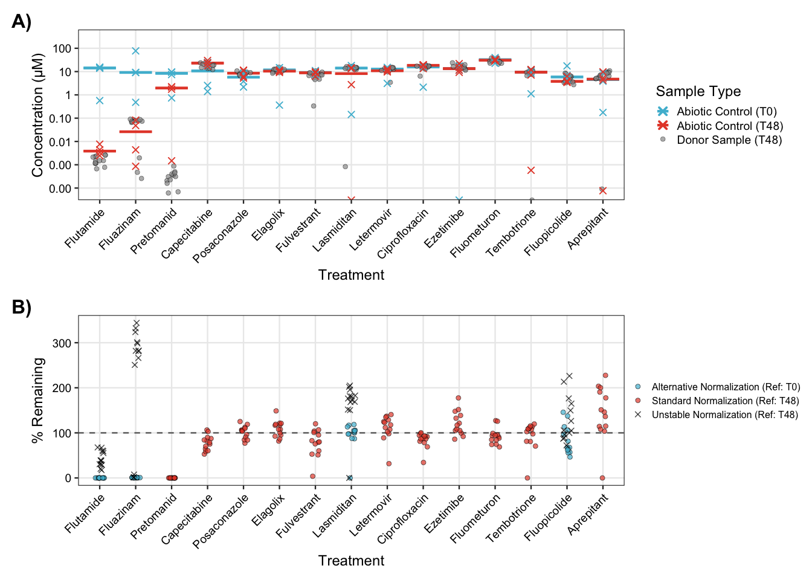<!-- -->

``` r
ggsave("results/Concentrations_vehicle_S1S2_merged.png", combined_plot,
       dpi = 320, units = "in", width = 14, height = 10)
```

------------------------------------------------------------------------

## 8. Abundance–Concentration Correlations

Spearman correlations between CLR-transformed genus abundance and %
compound remaining at t48. Ciprofloxacin excluded from main analysis
(shown separately).

``` r
breaksList_cor        <- seq(-1, 1, by = 0.01)
custom_blue_white_red <- blueWhiteRed(length(breaksList_cor), gamma = 1)

microbe_df <- psmelt(ps_clr_genus) %>%
  select(Patient, Treatment, Genus, Family, Abundance)

microbe_df <- microbe_df %>%
  mutate(
    F_Clean = Family %>% str_remove("^f__") %>% str_replace_all("_", " ") %>%
      str_remove_all("\\[|\\]") %>% str_trim(),
    G_Clean = Genus  %>% str_remove("^g__") %>% str_replace_all("_", " ") %>%
      str_remove_all("\\[|\\]") %>% str_trim(),
    Display_Name = case_when(
      str_detect(G_Clean, "Family XIII") ~
        paste0("f__", F_Clean, " (g__", str_remove(G_Clean, " group"), ")"),
      str_detect(G_Clean, fixed(F_Clean, ignore_case = TRUE)) ~
        paste0("g__", G_Clean),
      grepl("Eubacterium|group", G_Clean, ignore.case = TRUE) ~
        paste0("g__", G_Clean),
      grepl("UCG|CAG|UBA|uncultured|Incertae", G_Clean, ignore.case = TRUE) ~
        paste0("f__", F_Clean, " (g__", G_Clean, ")"),
      G_Clean == "" | is.na(G_Clean) | Genus == "g__" ~
        paste0("Unclassified f__", F_Clean),
      TRUE ~
        paste0("g__", G_Clean)
    )
  ) %>%
  select(-Genus, -F_Clean, -G_Clean) %>%
  rename(Genus = Display_Name)

drug_df <- calculated_concentrations %>%
  filter(Timepoint == "t48", Patient != "PBS") %>%
  filter(Treatment != "Ciprofloxacin") %>%
  left_join(references, by = "Treatment") %>%
  mutate(Conc_Remaining = (Calculated.Concentration / Final_Reference) * 100) %>%
  select(Patient, Treatment, Conc_Remaining) %>%
  drop_na(Conc_Remaining)

combined_df <- left_join(microbe_df, drug_df, by = c("Patient", "Treatment")) %>%
  drop_na(Abundance, Conc_Remaining)

correlation_results <- combined_df %>%
  group_by(Treatment, Genus) %>%
  filter(sum(!is.na(Abundance)) >= 5) %>%
  cor_test(vars = "Abundance", vars2 = "Conc_Remaining", method = "spearman") %>%
  adjust_pvalue(method = "BH")
```

### Panel A — Heatmap

``` r
all_hits <- correlation_results %>%
  filter(p <= 0.1 & abs(cor) >= 0.5)

top_genera_list <- all_hits %>%
  group_by(Genus) %>%
  summarise(Max_Cor = max(abs(cor)), .groups = "drop") %>%
  arrange(desc(Max_Cor)) %>%
  slice_head(n = 50) %>%
  pull(Genus)

heatmap_data <- correlation_results %>%
  filter(Genus %in% top_genera_list) %>%
  mutate(
    Significance_Label = case_when(
      p <= 0.001 ~ "***",
      p <= 0.01  ~ "**",
      p <= 0.05  ~ "*",
      p <= 0.1   ~ "·",
      TRUE       ~ ""
    ),
    vjust_val = if_else(Significance_Label == "·", 0.5, 0.8)
  )

matrix_data <- heatmap_data %>%
  select(Genus, Treatment, cor) %>%
  pivot_wider(names_from = Treatment, values_from = cor, values_fill = 0) %>%
  column_to_rownames("Genus") %>%
  as.matrix()


clust_rows <- hclust(dist(matrix_data,    method = "euclidean"), method = "ward.D2")
clust_cols <- hclust(dist(t(matrix_data), method = "euclidean"), method = "ward.D2")

heatmap_data_clustered <- heatmap_data %>%
  mutate(
    Genus     = factor(Genus,     levels = rownames(matrix_data)[clust_rows$order]),
    Treatment = factor(Treatment, levels = colnames(matrix_data)[clust_cols$order])
  )

Panel_A_Heatmap <- ggplot(heatmap_data_clustered, aes(x = Treatment, y = Genus, fill = cor)) +
  geom_tile(color = "white", linewidth = 0.2) +
  geom_text(aes(label = Significance_Label, vjust = vjust_val),
            size = 7, color = "black") +
  scale_fill_gradientn(
    colors = custom_blue_white_red,
    values = scales::rescale(breaksList_cor),
    limits = c(-1, 1),
    name   = "Rho"
  ) +
  labs(x = NULL, y = NULL) +
  theme_minimal(base_size = 18) +
  theme(
    axis.text.x = element_text(angle = 45, hjust = 1, color = "black"),
    axis.text.y = element_text(face = "italic", color = "black", size = 13),
    panel.grid  = element_blank()
  )

Panel_A_Heatmap
```

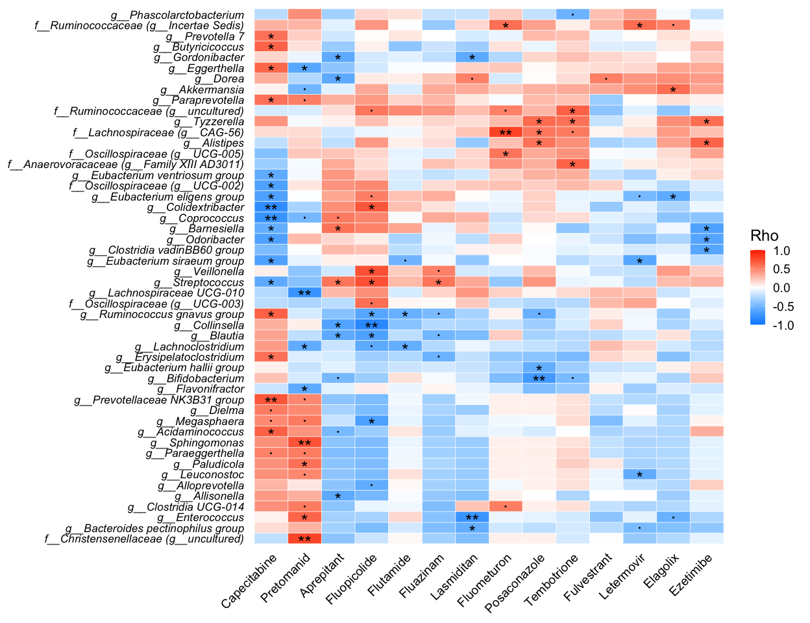<!-- -->

``` r
ggsave("results/Correlation_Heatmap.png", Panel_A_Heatmap, width = 13, height = 10, dpi = 320)
```

### Panel B — Scatter plots

``` r
priority_drugs <- c("Flutamide", "Fluazinam", "Pretomanid")

hits_priority <- correlation_results %>%
  filter(Treatment %in% priority_drugs, Genus %in% top_genera_list) %>%
  filter(p <= 0.1, cor < 0) %>%
  group_by(Treatment) %>%
  slice_min(order_by = cor, n = 1) %>%
  ungroup() %>%
  mutate(Type = "Priority")

hits_others <- correlation_results %>%
  filter(!Treatment %in% priority_drugs, Genus %in% top_genera_list) %>%
  filter(p <= 0.05, cor < -0.6) %>%
  group_by(Treatment) %>%
  slice_min(order_by = cor, n = 1) %>%
  ungroup() %>%
  mutate(Type = "Other")

top_scatter_hits <- bind_rows(hits_priority, hits_others) %>%
  arrange(factor(Type, levels = c("Priority", "Other")), cor) %>%
  slice_head(n = 6)

scatter_data <- combined_df %>%
  semi_join(top_scatter_hits, by = c("Treatment", "Genus")) %>%
  left_join(correlation_results %>% select(Treatment, Genus, cor, p),
            by = c("Treatment", "Genus")) %>%
  mutate(
    Panel_Label_Text = paste0(Treatment, " vs\n", Genus),
    Star_Label = case_when(
      p <= 0.001 ~ "(***)",
      p <= 0.01  ~ "(**)",
      p <= 0.05  ~ "(*)",
      p <= 0.1   ~ "(·)",
      TRUE       ~ ""
    ),
    Stats_Text = paste0("R = ", round(cor, 2), "\np = ", round(p, 3), " ", Star_Label)
  )

desired_order            <- unique(paste0(top_scatter_hits$Treatment, " vs\n", top_scatter_hits$Genus))
scatter_data$Panel_Label <- factor(scatter_data$Panel_Label_Text, levels = desired_order)

Panel_B_Scatter <- scatter_data %>%
  left_join(id_map, by = "Patient") %>%
  mutate(Patient = factor(Patient_new, levels = 1:13)) %>%
  ggplot(aes(x = Abundance, y = Conc_Remaining)) +
  geom_smooth(method = "lm", se = TRUE, color = "black",
              linetype = "solid", alpha = 0.2) +
  geom_point(aes(fill = Patient), size = 3, shape = 21,
             color = "black", stroke = 0.5, alpha = 0.8) +
  geom_text(aes(label = Stats_Text),
            x = -Inf, y = -Inf, hjust = -0.1, vjust = -0.2,
            size = 5.5, lineheight = 0.8,
            check_overlap = TRUE, inherit.aes = FALSE) +
  facet_wrap(~Panel_Label, scales = "free", ncol = 3) +
  scale_fill_viridis_d(option = "mako", name = "Donor") +
  labs(y = "% Remaining", x = "CLR Abundance") +
  theme_bw(base_size = 18) +
  theme(
    strip.text       = element_text(size = 14),
    panel.grid.minor = element_blank()
  )

Panel_B_Scatter
```

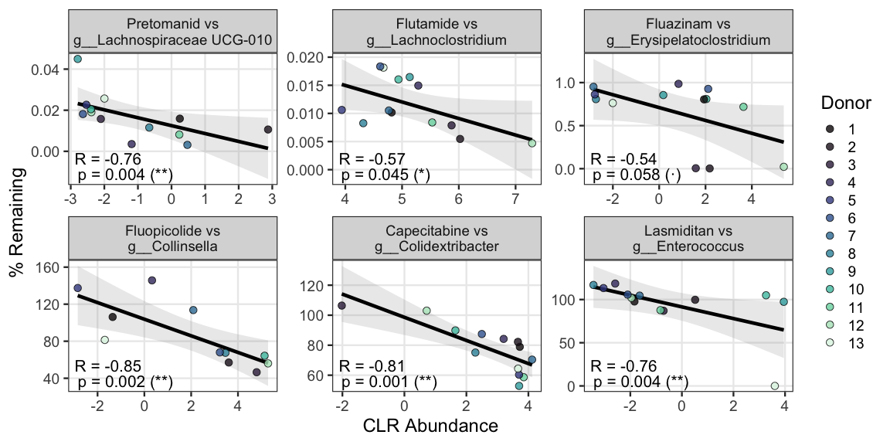<!-- -->

``` r
ggsave("results/Correlations_Scatter.png", Panel_B_Scatter, width = 12, height = 6, dpi = 320)
```

------------------------------------------------------------------------

## 9. Supplementary — Ciprofloxacin Correlations

Ciprofloxacin shown separately as an antibiotic that directly affects
bacterial composition, confounding abundance–concentration correlations.

``` r
drug_df_supp <- calculated_concentrations %>%
  filter(Timepoint == "t48", Patient != "PBS") %>%
  left_join(references, by = "Treatment") %>%
  mutate(Conc_Remaining = (Calculated.Concentration / Final_Reference) * 100) %>%
  select(Patient, Treatment, Conc_Remaining) %>%
  drop_na(Conc_Remaining)

combined_df_supp <- left_join(microbe_df, drug_df_supp, by = c("Patient", "Treatment")) %>%
  drop_na(Abundance, Conc_Remaining)

correlation_results_supp <- combined_df_supp %>%
  group_by(Treatment, Genus) %>%
  filter(sum(!is.na(Abundance)) >= 5) %>%
  cor_test(vars = "Abundance", vars2 = "Conc_Remaining", method = "spearman") %>%
  adjust_pvalue(method = "BH")
```

### Panel A — Cipro heatmap

``` r
cipro_victims <- correlation_results_supp %>%
  filter(Treatment == "Ciprofloxacin") %>%
  arrange(cor) %>%
  slice_head(n = 40) %>%
  pull(Genus)

heatmap_data_supp <- correlation_results_supp %>%
  filter(Genus %in% cipro_victims) %>%
  mutate(
    Significance_Label = case_when(
      p <= 0.001 ~ "***",
      p <= 0.01  ~ "**",
      p <= 0.05  ~ "*",
      p <= 0.1   ~ "·",
      TRUE       ~ ""
    ),
    vjust_val = if_else(Significance_Label == "·", 0.5, 0.8),
    size_val  = if_else(Significance_Label == "·", 7, 5)
  ) %>%
  mutate(Genus = factor(Genus, levels = rev(cipro_victims)))

matrix_supp     <- heatmap_data_supp %>%
  select(Genus, Treatment, cor) %>%
  pivot_wider(names_from = Treatment, values_from = cor, values_fill = 0) %>%
  column_to_rownames("Genus") %>%
  as.matrix()
clust_cols_supp <- hclust(dist(t(matrix_supp), method = "euclidean"), method = "ward.D2")

heatmap_data_supp <- heatmap_data_supp %>%
  mutate(Treatment = factor(Treatment, levels = colnames(matrix_supp)[clust_cols_supp$order]))

Supp_Figure_Cipro <- ggplot(heatmap_data_supp, aes(x = Treatment, y = Genus, fill = cor)) +
  geom_tile(color = "white", linewidth = 0.2) +
  geom_text(aes(label = Significance_Label, vjust = vjust_val, size = size_val),
            color = "black") +
  scale_size_identity() +
  scale_fill_gradientn(
    colors = custom_blue_white_red,
    values = scales::rescale(breaksList_cor),
    limits = c(-1, 1),
    name   = "Rho"
  ) +
  labs(x = NULL, y = NULL) +
  theme_minimal(base_size = 18) +
  theme(
    axis.text.x = element_text(angle = 45, hjust = 1, color = "black"),
    axis.text.y = element_text(face = "italic", color = "black", size = 12),
    panel.grid  = element_blank()
  )

Supp_Figure_Cipro
```

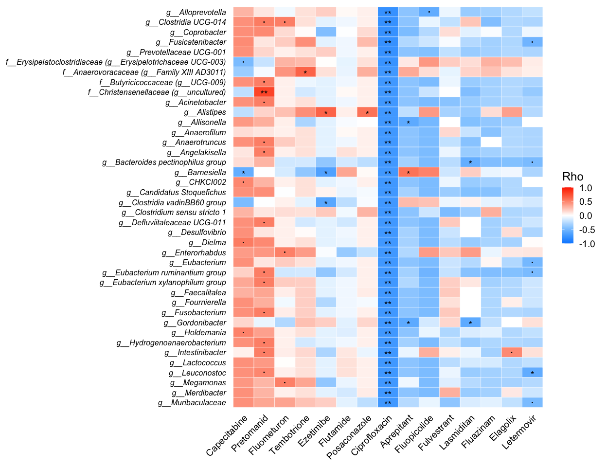<!-- -->

``` r
ggsave("results/Correlation_Supp_Cipro_Heatmap.png", Supp_Figure_Cipro,
       width = 13, height = 10, dpi = 320)
```

### Panel B — Cipro scatter plots

``` r
top_3_victims <- cipro_victims[1:3]

scatter_data_supp <- combined_df_supp %>%
  filter(Treatment == "Ciprofloxacin", Genus %in% top_3_victims) %>%
  left_join(correlation_results_supp %>% select(Treatment, Genus, cor, p),
            by = c("Treatment", "Genus")) %>%
  mutate(Stats_Text = paste0("R = ", round(cor, 2), "\np = ", signif(p, 3)))

Supp_Panel_B <- scatter_data_supp %>%
  left_join(id_map, by = "Patient") %>%
  mutate(Patient = factor(Patient_new, levels = 1:13)) %>%
  ggplot(aes(x = Abundance, y = Conc_Remaining)) +
  geom_smooth(method = "lm", se = TRUE, color = "black", linetype = "solid", alpha = 0.2) +
  geom_point(aes(fill = Patient), size = 3, shape = 21,
             color = "black", stroke = 0.5, alpha = 0.8) +
  geom_text(aes(label = Stats_Text),
            x = -Inf, y = -Inf, hjust = -0.1, vjust = -0.5,
            size = 4, check_overlap = TRUE, inherit.aes = FALSE) +
  facet_wrap(~Genus, scales = "free", ncol = 3) +
  scale_fill_viridis_d(option = "mako", name = "Donor") +
  labs(y = "% Cipro Remaining", x = "CLR Abundance") +
  theme_bw(base_size = 18)

Supp_Panel_B
```

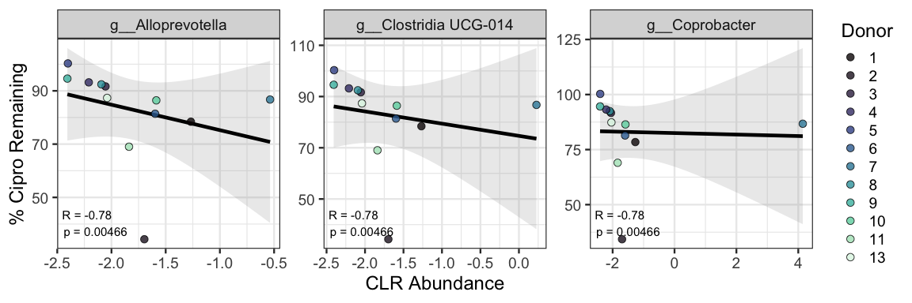<!-- -->

``` r
ggsave("results/Correlation_Supp_Scatter.png", Supp_Panel_B, width = 12, height = 4, dpi = 320)
```

------------------------------------------------------------------------

## 10. OD600 Analysis

OD measured as log2 fold-change relative to Vehicle per donor.

``` r
patient_treatment <- read.csv("data/od600/OD_summary.csv")

q_to_stars <- function(q) {
  case_when(
    is.na(q)   ~ "",
    q < 0.0001 ~ "****",
    q < 0.001  ~ "***",
    q < 0.01   ~ "**",
    q < 0.05   ~ "*",
    TRUE       ~ ""
  )
}
```

``` r
vehicle_by_donor <- patient_treatment %>%
  filter(Treatment == "Vehicle") %>%
  transmute(run_id, donor, vehicle_mean_od = mean_od)

patient_treatment_norm <- patient_treatment %>%
  filter(Treatment != "Vehicle") %>%
  left_join(vehicle_by_donor, by = c("run_id", "donor")) %>%
  mutate(log2_fc = log2(mean_od / vehicle_mean_od))

treatment_summary <- patient_treatment_norm %>%
  filter(sample_type == "donor") %>%
  group_by(treatment_id, Treatment) %>%
  summarise(
    n_donors        = n(),
    mean_log2_fc    = mean(log2_fc, na.rm = TRUE),
    sd_log2_fc      = sd(log2_fc,  na.rm = TRUE),
    p_value_log2_fc = t.test(log2_fc, mu = 0)$p.value,
    .groups = "drop") %>%
  mutate(q_value_log2_fc = p.adjust(p_value_log2_fc, method = "BH")) %>%
  arrange(q_value_log2_fc, desc(abs(mean_log2_fc)))

treatment_effects <- treatment_summary %>%
  mutate(
    se_log2_fc = sd_log2_fc / sqrt(n_donors),
    ci_half    = qt(0.975, df = n_donors - 1) * se_log2_fc,
    ci_low     = mean_log2_fc - ci_half,
    ci_high    = mean_log2_fc + ci_half,
    stars_y    = if_else(mean_log2_fc >= 0, ci_high + 0.03, ci_low - 0.03)
  ) %>%
  arrange(mean_log2_fc) %>%
  mutate(treatment_id = factor(treatment_id, levels = treatment_id))

treatment_effects3 <- treatment_effects %>%
  mutate(
    Treatment = factor(Treatment, levels = treatment_effects %>%
                         arrange(treatment_id) %>%
                         pull(Treatment))
  ) %>%
  mutate(
    q_value_log2_fc   = p.adjust(p_value_log2_fc, method = "BH"),
    sig_stars_log2_fc = q_to_stars(q_value_log2_fc)
  )

p_all <- ggplot(treatment_effects3, aes(x = Treatment, y = mean_log2_fc)) +
  geom_hline(yintercept = 0, linetype = "dashed", linewidth = 0.5,
             color = "grey40") +
  geom_errorbar(aes(ymin = ci_low, ymax = ci_high), width = 0.4, alpha = 0.8) +
  geom_point(size = 2.2) +
  geom_text(
    data = treatment_effects3 %>% filter(sig_stars_log2_fc != ""),
    aes(y = stars_y, label = sig_stars_log2_fc),
    size = 9, color = "black", vjust = 0.5, nudge_x = -0.3
  ) +
  coord_flip() +
  labs(y = "Mean log2 fold-change", x = NULL) +
  theme_bw(base_size = 18) +
  scale_y_continuous(expand = expansion(mult = c(0.15, 0.15)))

p_all
```

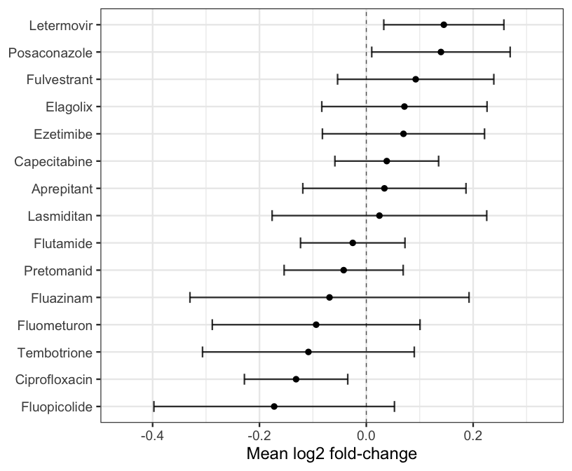<!-- -->

``` r
ggsave("results/FoldChange_OD_clean.png", p_all, width = 8.5, height = 7, dpi = 320)
```

------------------------------------------------------------------------

    ## R version 4.5.2 (2025-10-31)
    ## Platform: x86_64-apple-darwin20
    ## Running under: macOS Tahoe 26.4.1
    ## 
    ## Matrix products: default
    ## BLAS:   /System/Library/Frameworks/Accelerate.framework/Versions/A/Frameworks/vecLib.framework/Versions/A/libBLAS.dylib 
    ## LAPACK: /Library/Frameworks/R.framework/Versions/4.5-x86_64/Resources/lib/libRlapack.dylib;  LAPACK version 3.12.1
    ## 
    ## locale:
    ## [1] en_US.UTF-8/en_US.UTF-8/en_US.UTF-8/C/en_US.UTF-8/en_US.UTF-8
    ## 
    ## time zone: Europe/Zurich
    ## tzcode source: internal
    ## 
    ## attached base packages:
    ## [1] grid      stats     graphics  grDevices utils     datasets  methods   base     
    ## 
    ## other attached packages:
    ##  [1] patchwork_1.3.2       scales_1.4.0          pairwiseAdonis_0.4.1  cluster_2.1.8.1       emmeans_2.0.1         lmerTest_3.1-3       
    ##  [7] lme4_1.1-38           Matrix_1.7-4          ggpubr_0.6.2          rstatix_0.7.3         lubridate_1.9.4       forcats_1.0.1        
    ## [13] stringr_1.6.0         dplyr_1.1.4           purrr_1.2.0           readr_2.1.6           tidyr_1.3.2           tibble_3.3.0         
    ## [19] tidyverse_2.0.0       vegan_2.7-2           permute_0.9-8         WGCNA_1.73            fastcluster_1.3.0     dynamicTreeCut_1.63-1
    ## [25] pheatmap_1.0.13       ANCOMBC_2.10.0        microbiome_1.30.0     ggplot2_4.0.1         phyloseq_1.52.0      
    ## 
    ## loaded via a namespace (and not attached):
    ##   [1] splines_4.5.2           cellranger_1.1.0        preprocessCore_1.70.0   rpart_4.1.24            lifecycle_1.0.4         Rdpack_2.6.4           
    ##   [7] doParallel_1.0.17       vroom_1.6.7             lattice_0.22-7          MASS_7.3-65             backports_1.5.0         magrittr_2.0.4         
    ##  [13] Hmisc_5.2-4             sass_0.4.10             rmarkdown_2.30          jquerylib_0.1.4         yaml_2.3.12             otel_0.2.0             
    ##  [19] doRNG_1.8.6.2           gld_2.6.8               DBI_1.2.3               minqa_1.2.8             RColorBrewer_1.1-3      ade4_1.7-23            
    ##  [25] multcomp_1.4-29         abind_1.4-8             expm_1.0-0              Rtsne_0.17              BiocGenerics_0.54.1     nnet_7.3-20            
    ##  [31] TH.data_1.1-5           sandwich_3.1-1          GenomeInfoDbData_1.2.14 IRanges_2.42.0          S4Vectors_0.46.0        pbkrtest_0.5.5         
    ##  [37] codetools_0.2-20        energy_1.7-12           tidyselect_1.2.1        UCSC.utils_1.4.0        farver_2.1.2            gmp_0.7-5              
    ##  [43] matrixStats_1.5.0       stats4_4.5.2            base64enc_0.1-3         jsonlite_2.0.0          multtest_2.64.0         e1071_1.7-17           
    ##  [49] Formula_1.2-5           survival_3.8-3          iterators_1.0.14        systemfonts_1.3.1       foreach_1.5.2           tools_4.5.2            
    ##  [55] ragg_1.5.0              DescTools_0.99.60       Rcpp_1.1.0              glue_1.8.0              gridExtra_2.3           xfun_0.55              
    ##  [61] mgcv_1.9-4              GenomeInfoDb_1.44.3     withr_3.0.2             numDeriv_2016.8-1.1     fastmap_1.2.0           boot_1.3-32            
    ##  [67] rhdf5filters_1.20.0     digest_0.6.39           estimability_1.5.1      timechange_0.3.0        R6_2.6.1                textshaping_1.0.4      
    ##  [73] colorspace_2.1-2        GO.db_3.21.0            gtools_3.9.5            RSQLite_2.4.5           generics_0.1.4          data.table_1.18.0      
    ##  [79] class_7.3-23            CVXR_1.0-15             httr_1.4.7              htmlwidgets_1.6.4       pkgconfig_2.0.3         gtable_0.3.6           
    ##  [85] Exact_3.3               Rmpfr_1.1-2             blob_1.2.4              S7_0.2.1                impute_1.82.0           XVector_0.48.0         
    ##  [91] htmltools_0.5.9         carData_3.0-5           biomformat_1.36.0       Biobase_2.68.0          lmom_3.2                png_0.1-8              
    ##  [97] reformulas_0.4.3        knitr_1.51              rstudioapi_0.17.1       tzdb_0.5.0              reshape2_1.4.5          coda_0.19-4.1          
    ## [103] checkmate_2.3.3         nlme_3.1-168            nloptr_2.2.1            proxy_0.4-29            cachem_1.1.0            zoo_1.8-15             
    ## [109] rhdf5_2.52.1            rootSolve_1.8.2.4       parallel_4.5.2          foreign_0.8-90          AnnotationDbi_1.70.0    pillar_1.11.1          
    ## [115] vctrs_0.6.5             car_3.1-3               xtable_1.8-4            htmlTable_2.4.3         evaluate_1.0.5          mvtnorm_1.3-3          
    ## [121] cli_3.6.5               compiler_4.5.2          rlang_1.1.6             crayon_1.5.3            rngtools_1.5.2          ggsignif_0.6.4         
    ## [127] labeling_0.4.3          plyr_1.8.9              fs_1.6.6                stringi_1.8.7           viridisLite_0.4.2       Biostrings_2.76.0      
    ## [133] gsl_2.1-9               hms_1.1.4               bit64_4.6.0-1           Rhdf5lib_1.30.0         KEGGREST_1.48.1         haven_2.5.5            
    ## [139] rbibutils_2.4           igraph_2.2.1            broom_1.0.11            memoise_2.0.1           bslib_0.9.0             bit_4.6.0              
    ## [145] readxl_1.4.5            ape_5.8-1
